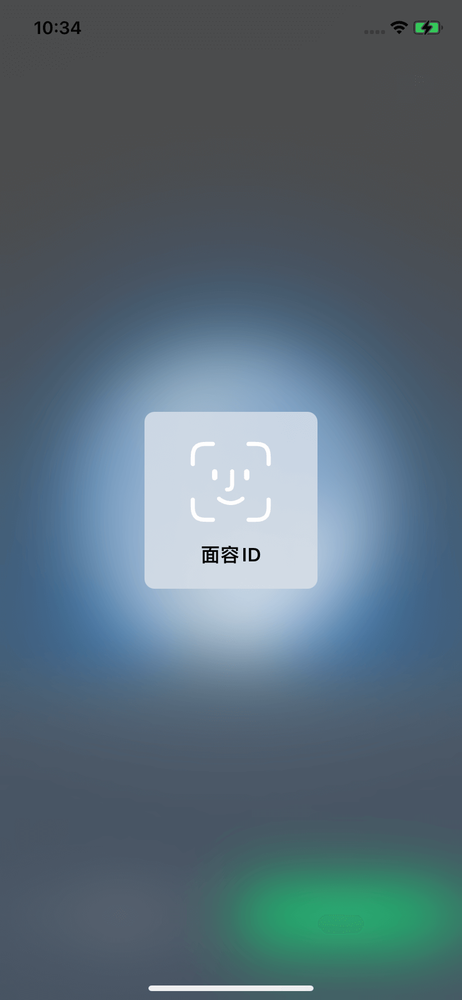
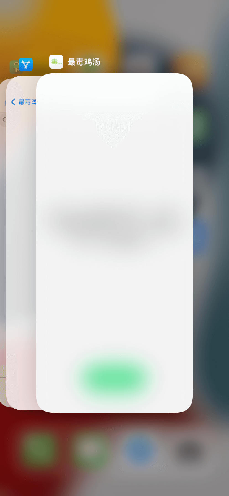
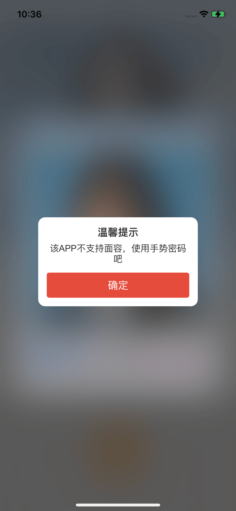
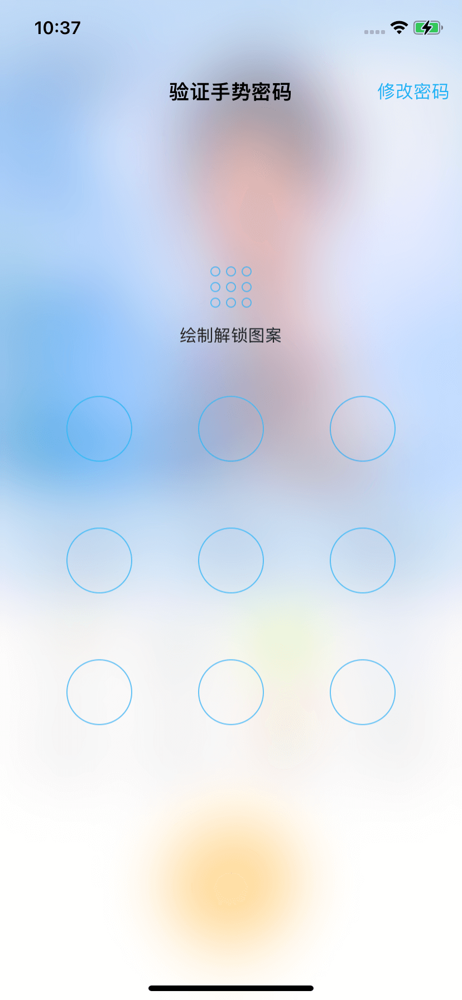

# LPAppLock 给任意APP添加人脸和手势解锁

[now-on-havoc]: https://havoc.app/package/LPAppLock

[][now-on-havoc]

## 功能说明 Function Description
- 🌟 **人脸解锁优先**：如果设备支持人脸识别，APP将优先使用人脸解锁；否则，将使用手势密码解锁。
- 🌟 **隐私保护**：当APP退到后台时，会显示透明蒙层，提供更好的隐私保护效果。
- 🌟 **无版本限制**：该APP没有iOS版本限制和APP限制，适用于所有版本和应用。
- 🌟 **Face unlock priority**: If the device supports face recognition, the APP will prioritize face unlocking; otherwise, it will use gesture password unlocking.
- 🌟 **Privacy protection**: When the APP retreats to the background, a transparent mask will be displayed to provide better privacy protection.
- 🌟 **No version restrictions**: This APP has no iOS version restrictions and APP restrictions, and is applicable to all versions and applications.

## 使用说明 Instructions
- 🌟 **下载与注入**：下载 APPLock.dylib 并使用工具进行注入。
- 🌟 **巨魔用户**：巨魔用户可以直接使用 [TrollFools](https://github.com/Lessica/TrollFools) 进行注入。
- 🌟 **签名工具**：也可以使用签名工具进行注入，例如[轻松签+](https://esing.yyyue.xyz/)等其他签名工具。
- 🌟 **Download and Inject**: Download APPLock.dylib and use the tool to inject.
- 🌟 **Troll User**: Troll users can directly use [TrollFools](https://github.com/Lessica/TrollFools) to inject.
- 🌟 **Signature Tool**: You can also use signature tools for injection, such as [ESign+](https://esing.yyyue.xyz/) and other signature tools.

## 人脸验证 Face verification

## 后台蒙层 Background mask

# 手势密码 Gesture password

