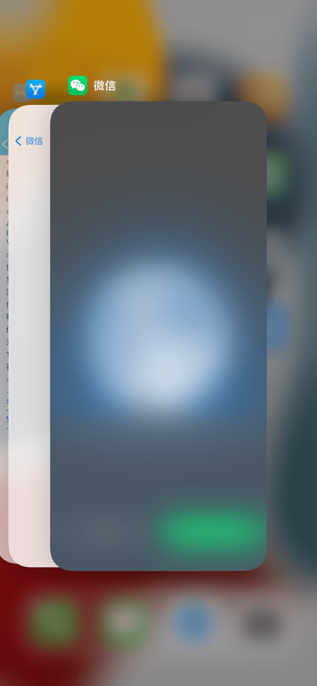

# LPAppLock 给任意APP添加人脸和手势解锁

[now-on-havoc]: https://havoc.app/package/LPAppLock

[][now-on-havoc]

## 功能说明
- 🌟 APP支持人脸会优先使用人脸解锁，不支持的会使用手势密码解锁
- 🌟 支持APP退到后台显示透明蒙层，隐私效果更好
- 🌟 没有iOS版本限制和APP限制

## 使用说明
- 🌟 下载APPLock.dylib使用工具注入
- 🌟 巨魔用户可直接使用[TrollFools](https://github.com/Lessica/TrollFools)注入
- 🌟 或者签名工具签名注入使用（[轻松签+](https://esing.yyyue.xyz/)等其他签名工具）

## 人脸验证

## 后台蒙层

# 手势密码

